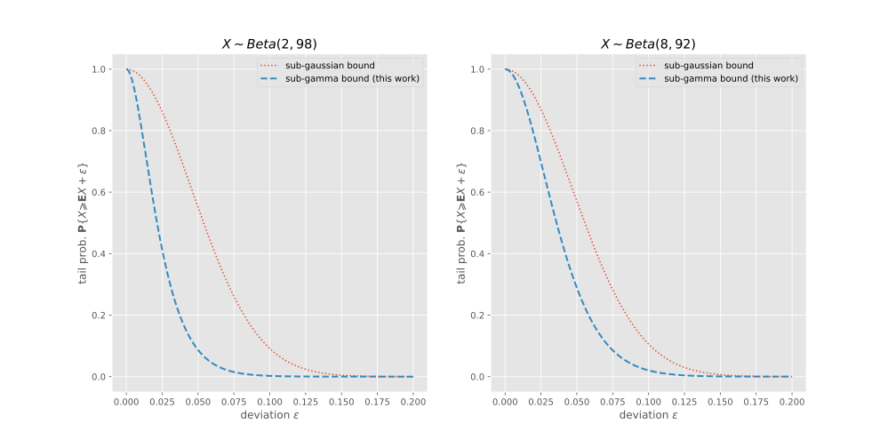

# Tail Bounds of Beta Distribution

Repository of the paper "Bernstein-Type Bounds for Beta Distribution".

The work introduces a novel handy recursion for central moments $\mu_d$ of beta distribution with shape $(\alpha,\beta)$:
$$\mu_{d} = \frac{\alpha \beta \left(d - 1\right)}{\left(\alpha + \beta\right)^{2} \left(\alpha + \beta + d - 1\right)}\cdot \mu_{d - 2} + \frac{\left(- \alpha + \beta\right) \left(d - 1\right)}{\left(\alpha + \beta\right) \left(\alpha + \beta + d - 1\right)}\cdot \mu_{d - 1},\quad \mu_0=1,\mu_0=0$$
and uses this recurision to derive optimal Bernstein-type (or: sub-gamma) tail bounds:
$$\mathbf{P}(X > \mathbf{E}[X]+\epsilon )  \leqslant \exp\left(-\frac{\epsilon^{2}}{2 v+\frac{2\max(c,0) \epsilon }{3}}\right)$$
with $v \triangleq {\frac{\alpha\beta}{(\alpha+\beta)^2(\alpha+\beta+1)}}$ and $c \triangleq  \frac{2 \left(\beta - \alpha\right)}{\left(\alpha + \beta\right) \left(\alpha + \beta + 2\right)}$. 

These bounds are better than sub-gaussian bounds from pror work, as shown in the figure below

$$
\begin{cases}
\exp\left(-\frac{\epsilon^{2}}{2 \left(v+\frac{\max(c,0) \epsilon}{3} \right)}\right) & \beta\geqslant \alpha \\
\exp\left(-\frac{\epsilon^{2}}{2v} \right) & \beta < \alpha,
\end{cases}
$$

The implementation is shared in the [notebook](/Beta_SubGamma.ipynb) and the paper is available at [arXiv](https://arxiv.org/abs/2101.02094).